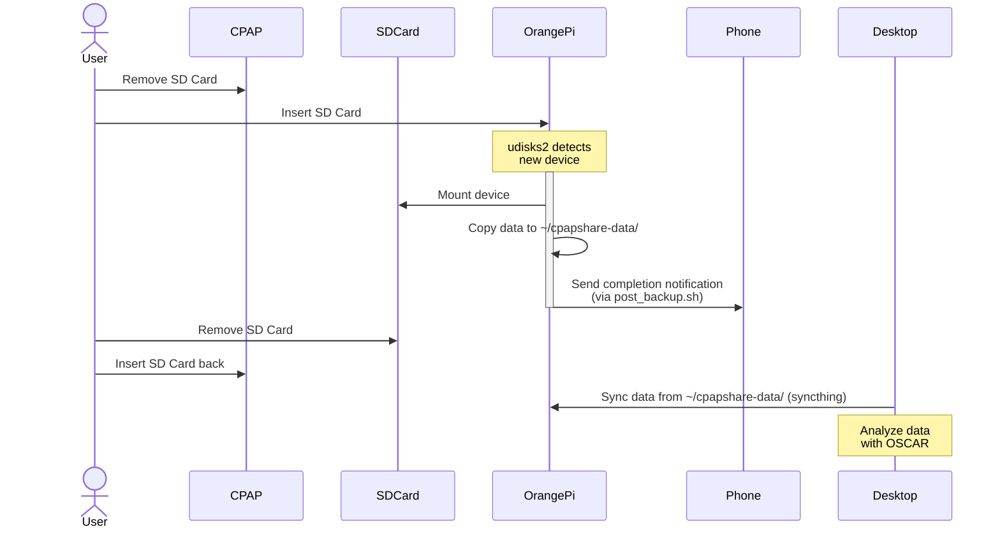
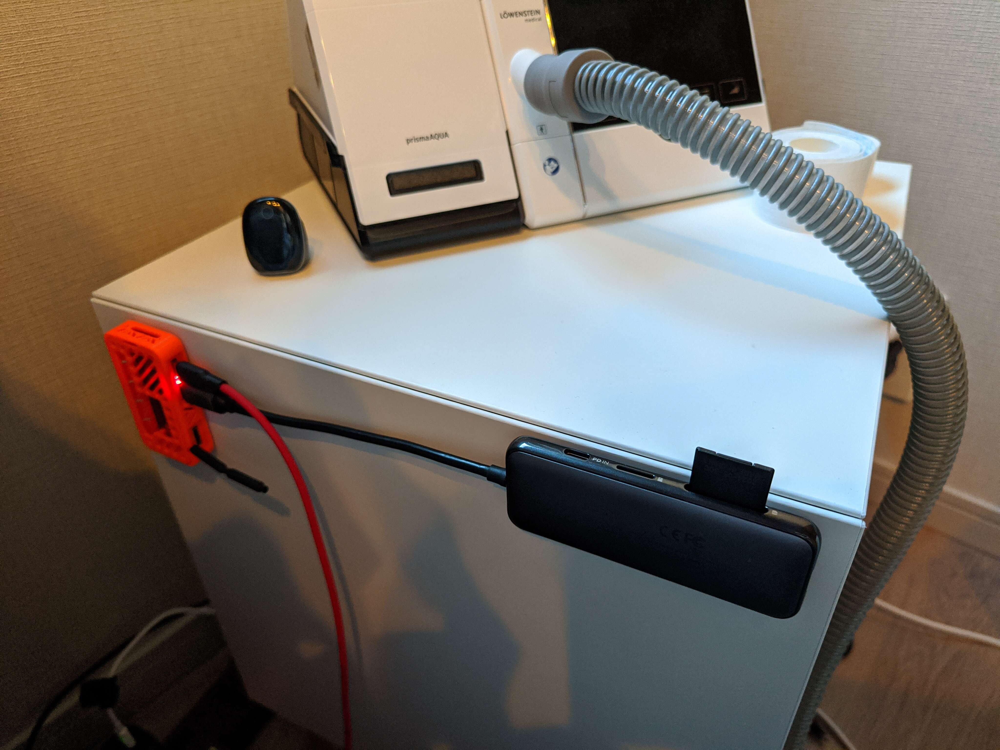

<div align="center">
  


</div>

# CPAPShare

## The Problem

You know that daily routine? Take out the SD card from the CPAP, check the results on [OSCAR](https://www.sleepfiles.com/OSCAR/), and then... oops, forgot to put it back in the machine. Every. Single. Time. 

I tried finding a better way - like using wifi SD cards (EZShare), but no luck with my CPAP (Lowenstein Prisma Smart). Seems like the CPAP doesn't provide enough juice to power them properly.

## My "Good Enough" Solution

Instead of fancy expensive hardware, here's what I came up with:
1. Put a small single-board computer (like an Orange Pi Zero 2W) next to the CPAP
2. In the morning, quickly swap the SD card from CPAP to the board
3. Let it automatically backup the data somewhere I can access from my desktop
4. Done!

Sure, there are fancier solutions like SD card muxers (like the [USB-SD-Mux](https://linux-automation.com/en/products/usb-sd-mux-fast.html)), but they're expensive and probably overkill. Plus, who knows if they'd even work with a CPAP?

### Hardware Requirements

- [Orange Pi Zero 2W 1GB](https://www.aliexpress.com/item/1005005979335218.html) (or any Linux-capable single-board computer)
- A USB SD card reader (I use [Vava USB-C hub](https://www.vava.com/products/vava-hub-p8-ii))
- MicroSD card for the Orange Pi (I recommend [SanDisk Ultra A1 SDSQUAB-064G-GH3MA](https://www.amazon.co.jp/dp/B0CH2XQN3P)) 

### Flow 



## Setting Things Up

1. Flash [Armbian](https://www.armbian.com/) to your Orange Pi's MicroSD card
2. Edit `/root/.not_logged_in_yet` . ([see Armbian docs](https://docs.armbian.com/User-Guide_Autoconfig/#sample-config-file)) 
3. SSH into the device: `ssh root@YOUR_DEVICE_IP`
4. Update system: 
```shell
sudo apt update && sudo apt full-upgrade --yes && sudo reboot`
```
5. install the dependencies:

```shell
sudo apt install curl udisks2 policykit-1-gnome ruby ruby-dbus ruby-optimist
```

6. Clone this repository with:

```shell
git clone https://github.com/pcboy/cpapshare ~/cpapshare
```

7. If you can't mount devices as user `armbian`, that means you are missing the polkit policy. In that case do:

```shell
sudo cpapshare.rb --install
```

This adds a polkit config allowing members of the `sudo` group to mount devices.

## Auto Start on boot (SystemD service)

The project includes a SystemD service file ([cpapshare.service](./cpapshare.service)). To enable it:
```shell
sudo cp cpapshare.service /etc/systemd/system/cpapshare.service
systemctl enable cpapshare.service
```

## Callback on backup completion

The `cpapshare.rb` also has a mechanism to trigger some callback script after the backup is done. You simply need to have a file `post_backup.sh` in the same directory as the cpapshare.rb file.  
Check example [post_backup.example.sh](./post_backup.example.sh), I'm using it to send a notification to [ntfy.sh](http://ntfy.sh), so I get notified on my phone when the backup is done. Make sure the script is executable.

## Syncing to Your Computer

I recommend using Syncthing - it's perfect for sharing the backup folder with your desktop:

1. Install it from https://apt.syncthing.net/
2. Enable and start it:
   ```shell
   systemctl enable syncthing@armbian.service && systemctl start syncthing@armbian.service
   ```
3. Access the web interface at `http://ORANGE_IP:8384`
   - If you can't access it, edit `/home/armbian/.local/state/syncthing/config.xml` to change listen address from `127.0.0.1` to `0.0.0.0`

4. Share the ~/cpapshare-data folder from the Opi and you are good to go.

Then in OSCAR, you just import data from your synced folder, and I recommend to set in OSCAR's preferences the `Import without asking for confirmation` on the `Import tab`. Then each time you open OSCAR it will just automatically import latest available data from the synced folder.

## Final setup

Here's how I have it set up: Orange Pi Zero 2W stuck to my bedside table with [double-sided magic tape](https://www.amazon.co.jp/-/en/Repeatedly-Removable-Waterproof-Multifunctional-Industrial/dp/B07ZFCHR8X) (orange box on the left), and the SD card reader on the right.

I 3D printed the Opi5 box from this model: https://www.printables.com/model/1124421-orange-pi-zero-2w-case


